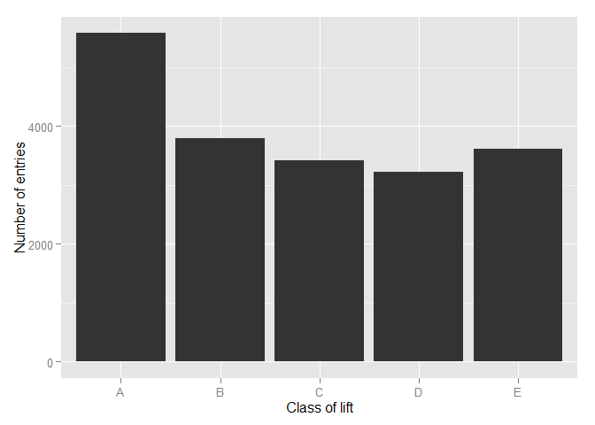
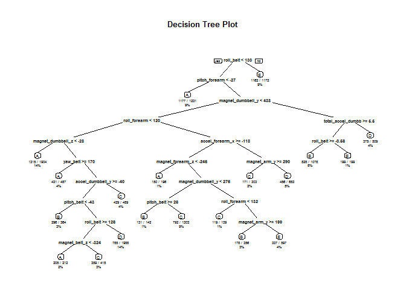

# Practical Machine Learning Coursework Project
James Carroll  
Saturday, April 25, 2015  


#Executive Summary
This paper utilises data collected by sensors similar to the rise in Personal Fitness Sensors such as JawBone or FitBit. Using measurements collected when particpants performed a range of lifts this paper trains, validates, and tests two models of machine learning, Decision Trees and Random Forests. 
The paper finds that the Decision Tree model is reasonable at predicting the class of lift using the data provided, however, the Random Forest is substantially better. This finding is confirmed by its use to successfully predict all 20 of the test data items. 

#Background
Particpants were supervised by professional fitness instructors to conduct a lift correctly and incorrectly. Data was collected from sensors placed on the particpants and provides a range of movement values as well as a ```classe``` variable denoting which of 5 categories the lift fell into: 

* exactly according to the specification (Class A)
* throwing the elbows to the front (Class B)
* lifting the dumbbell only halfway (Class C)
* lowering the dumbbell only halfway (Class D)
* throwing the hips to the front (Class E)


Further information on the dataset or the collect of the measurements is available from the website here: http://groupware.les.inf.puc-rio.br/har (see the section on the Weight Lifting Exercise Dataset).

#Data Loading and Preparation
This paper uses two datasets; a training dataset comprising 19622 rows, and the testing dataset comprising 20 rows. 

After loading the training data a small exploration reveals many of the 160 columns are missing data. Therefore as part of the preparation, after confirming that the complete cases do not favour a particular class, columns which did not have any data in were removed which reduces the number of columns to 60. Finally participant, date, and time values were also removed reducing the number of columns to 53. 

A small graph demonstrates the distribution of entries across the various classes. As it doesn't appear to favour any one particular class too much the modelling can proceed. 


 

Finally to ensure the reproducibility of this paper the starting seed of the Pseudo Random Number generation is set 

```r
set.seed(1234)
```

#Cross Validation
When building a machine learning model it is important to validate the models created so as to confirm which is superior. However, this can not be done on the dataset that will be used to test the over performance of the chosen model as doing so would provide additional training to the model, compromising the independence of the testing set. 

To overcome this obstacle, and as the training dataset provided is large, the model can be built on part of the data and validate on another part. This practice is called Cross Validation. There are many forms of cross validation, the one that is used in this paper is to subset training data into two parts; a large part for initial training, and a smaller part for validation. This validation set allows a preliminary test to be done to allow for determining which model is superior. 

The training data set used in this paper is broken into two parts, 70% to be used for training, and 30% for validation. This gives a training subset of 13737 observations, and validation subset of 5885 observations. 

#Decision Tree
The first model to be trained is a decision tree. This model attempts to separate the data with absolute statements about the value of particular variables. The decision tree is trained on the training set and results in a structure as demonstrated below. 


```r
decisiontree <- rpart(classe~., data=trainingSubSet, method="class")
```
 

#Random Forest
The second model to be trained is a Random Forest which works similarly to a Decision Tree but allows a random selection of the variables to determine the separation at each level. 


```r
randommodel <- randomForest(classe~., data=trainingSubSet, method="class")
```

#Validating the Models
Having trained both models they are now validated on the validation subset as created earlier. 


```r
validatedecisiontree <- predict(decisiontree, validationSubSet, type="class")
DecisionTreePredictionResults <- confusionMatrix(validatedecisiontree, validationSubSet$classe)
```


```r
validaterandommodel <- predict(randommodel, validationSubSet, type="class")
RandomForestPredictionResults <- confusionMatrix(validaterandommodel, validationSubSet$classe)
```

#Comparing the Two Models
Confusion Matricies are generated to determine the accuracy of the each model. 

First, consider the results for the Decision Tree prediction.


```r
DecisionTreePredictionResults
```

```
## Confusion Matrix and Statistics
## 
##           Reference
## Prediction    A    B    C    D    E
##          A 1394  244   18   78   28
##          B   31  586   71   42   82
##          C   49   91  795   84   97
##          D  191  185  130  695  170
##          E    9   33   12   65  705
## 
## Overall Statistics
##                                          
##                Accuracy : 0.7094         
##                  95% CI : (0.6976, 0.721)
##     No Information Rate : 0.2845         
##     P-Value [Acc > NIR] : < 2.2e-16      
##                                          
##                   Kappa : 0.6327         
##  Mcnemar's Test P-Value : < 2.2e-16      
## 
## Statistics by Class:
## 
##                      Class: A Class: B Class: C Class: D Class: E
## Sensitivity            0.8327  0.51449   0.7749   0.7210   0.6516
## Specificity            0.9126  0.95238   0.9339   0.8626   0.9752
## Pos Pred Value         0.7911  0.72167   0.7124   0.5069   0.8556
## Neg Pred Value         0.9321  0.89099   0.9516   0.9404   0.9255
## Prevalence             0.2845  0.19354   0.1743   0.1638   0.1839
## Detection Rate         0.2369  0.09958   0.1351   0.1181   0.1198
## Detection Prevalence   0.2994  0.13798   0.1896   0.2330   0.1400
## Balanced Accuracy      0.8727  0.73343   0.8544   0.7918   0.8134
```

Second, the results for the Random Forest prediction. 


```r
RandomForestPredictionResults
```

```
## Confusion Matrix and Statistics
## 
##           Reference
## Prediction    A    B    C    D    E
##          A 1672    4    0    0    0
##          B    2 1134    7    0    0
##          C    0    1 1018    9    0
##          D    0    0    1  954    2
##          E    0    0    0    1 1080
## 
## Overall Statistics
##                                          
##                Accuracy : 0.9954         
##                  95% CI : (0.9933, 0.997)
##     No Information Rate : 0.2845         
##     P-Value [Acc > NIR] : < 2.2e-16      
##                                          
##                   Kappa : 0.9942         
##  Mcnemar's Test P-Value : NA             
## 
## Statistics by Class:
## 
##                      Class: A Class: B Class: C Class: D Class: E
## Sensitivity            0.9988   0.9956   0.9922   0.9896   0.9982
## Specificity            0.9991   0.9981   0.9979   0.9994   0.9998
## Pos Pred Value         0.9976   0.9921   0.9903   0.9969   0.9991
## Neg Pred Value         0.9995   0.9989   0.9984   0.9980   0.9996
## Prevalence             0.2845   0.1935   0.1743   0.1638   0.1839
## Detection Rate         0.2841   0.1927   0.1730   0.1621   0.1835
## Detection Prevalence   0.2848   0.1942   0.1747   0.1626   0.1837
## Balanced Accuracy      0.9989   0.9969   0.9951   0.9945   0.9990
```

In comparing the two it is clear that the Random Forest model is far superior to that of the Decision Tree. 

The Decision tree model mis-classifies a large number of items as is demonstrated in the Prediction vs. Reference table at the start of the print out. Further statistics reveal that the accuracy is between 73.7% and 75.9% which could be better. 

Comparatively the Random Forest model mis-classifies only 25 of the 5885 observations as shown in the Prediction vs. Reference table. This gives an accuracy rate of 99.6% which is much superior to that of Decision Tree.

The Sensitivity, Specificity, and Predictive Power of the Random Forest model is also stronger across all classes than that of the Decision Tree.

#Decision
These results confirm a clear choice of the Random Forest model over the Decision Tree model for use in predicting the classes of the test data. Predicting the test case classes yeilds the following results; 


```r
Test.Random.Forest
```

```
##  1  2  3  4  5  6  7  8  9 10 11 12 13 14 15 16 17 18 19 20 
##  B  A  B  A  A  E  D  B  A  A  B  C  B  A  E  E  A  B  B  B 
## Levels: A B C D E
```

These results have been submitted and are confirmed to have correctly identified each line item. 

#Sample Error Rates
For determining error rates of the predictions this paper uses the one minus accuracy measurement. Our in-sample error rate is then easily estimated as one minus the accuracy of the Random Forest model (which was selected as the preferred model), or in this case 1-0.9958 which evaluates to 0.0042, or approximately 4%. 

This estimate of the in-sample error rate can be used as a guide to the out of sample error rate, however, it is important to remember that it is only a guide and is likely an underestimate of the true out-sample error rate. 


